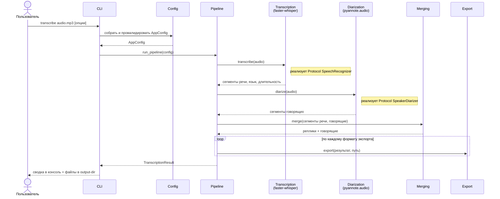

<div align="center">

# 🎙️ PyAudioTranscriptor

**Локальная CLI-утилита на Python для транскрибации аудиозаписей с разделением говорящих**

[](https://www.python.org/)
[](https://docs.astral.sh/uv/)
[](https://github.com/SYSTRAN/faster-whisper)
[](https://github.com/pyannote/pyannote-audio)
[](#)
[](#выбор-устройства-cpugpu)

</div>

Инструмент для подготовки стенограмм переговоров, интервью и судебных
материалов: распознаёт речь, определяет, кто из собеседников что говорит, и
экспортирует стенограмму в удобном формате с явной разметкой говорящих.

Вся обработка выполняется полностью локально, без обращения к облачным API —
аудио и текст никогда не покидают ваш компьютер.

## Содержание

- [Возможности](#возможности)
- [Требования](#требования)
- [Установка](#установка)
- [Быстрый запуск](#быстрый-запуск-без-ручной-установки-и-параметров-в-командной-строке)
- [Использование](#использование-вручную-через-uv)
  - [Повышение точности распознавания](#повышение-точности-распознавания)
  - [Токен доступа для диаризации](#токен-доступа-для-диаризации)
  - [Выбор устройства (CPU/GPU)](#выбор-устройства-cpugpu)
  - [Логи](#логи)
- [Архитектура](#архитектура)
  - [Структура каталогов](#структура-каталогов)
  - [Назначение компонентов](#назначение-компонентов)
- [Тестирование](#тестирование)
  - [Интеграционные тесты](#интеграционные-тесты)
- [Разработка](#разработка)

## Возможности

- Распознавание речи полностью локально через [faster-whisper](https://github.com/SYSTRAN/faster-whisper).
- Определение говорящих (диаризация) через [pyannote.audio](https://github.com/pyannote/pyannote-audio).
- Автоматический выбор CUDA при наличии GPU или CPU при его отсутствии.
- Экспорт стенограммы в TXT, DOCX, JSON и SRT с разметкой говорящих.
- Возможность задать пользовательские имена говорящих вместо `SPEAKER_00`, `SPEAKER_01`, ...
- Современный CLI на [Typer](https://typer.tiangolo.com/) с подробным `--help`.

## Требования

- Python 3.14+.
- [uv](https://docs.astral.sh/uv/) для управления зависимостями и виртуальным окружением.
- (опционально) NVIDIA GPU с установленными CUDA-драйверами для ускорения через PyTorch.
  При отсутствии CUDA утилита автоматически переходит на CPU.
- Бесплатный аккаунт на [huggingface.co](https://huggingface.co) и токен доступа —
  требуется модели диаризации, см. раздел [«Токен доступа для
  диаризации»](#токен-доступа-для-диаризации). Без него шаг определения
  говорящих завершится ошибкой с пояснением, что делать.

## Установка

```bash
git clone <url-репозитория>
cd PyAudioTranscriptor
uv sync
```

Команда `uv sync` создаст виртуальное окружение `.venv`, установит все
зависимости из `pyproject.toml`/`uv.lock` и саму утилиту в редактируемом режиме.

На Windows/Linux в зависимости уже включена CUDA-сборка PyTorch (см. раздел
[«Выбор устройства (CPU/GPU)»](#выбор-устройства-cpugpu)), поэтому `uv sync`
скачивает несколько гигабайт (в основном сам `torch` с бинарниками CUDA) —
это нормально и происходит один раз.

## Быстрый запуск (без ручной установки и параметров в командной строке)

В репозитории есть готовые скрипты-обёртки: `run.sh` (Linux/macOS) и
`run.ps1` / `run.bat` (Windows) — они не требуют команд `uv` и параметров в
командной строке. Скрипты сами устанавливают `uv`, если его нет, и запускают
транскрибацию с параметрами, которые вы один раз укажете в файле
`config.env`.

**Настройка (один раз):**

1. Скопируйте `config.example.env` в `config.env`.
2. Откройте `config.env` и укажите свой токен Hugging Face (см. раздел
   [«Токен доступа для диаризации»](#токен-доступа-для-диаризации)) и другие
   параметры — модель, язык, имена говорящих и т.д.

**Запуск:**

- Linux/macOS:
  ```bash
  ./run.sh path/to/call.mp3
  ```
- Windows (PowerShell):
  ```powershell
  .\run.ps1 path\to\call.mp3
  ```
- Windows (без терминала): перетащите аудиофайл мышью на `run.bat`.

Если позже понадобится изменить модель, язык, формат экспорта или другие
параметры — не нужно ничего вспоминать, просто откройте `config.env` и
поменяйте нужное значение.

## Использование (вручную, через uv)

Запуск через `uv run`:

```bash
uv run audio-transcriber transcribe path/to/call.mp3
```

Также доступен запуск как модуль Python:

```bash
uv run python -m audio_transcriber transcribe path/to/call.mp3
```

Полная справка по параметрам:

```bash
uv run audio-transcriber transcribe --help
```

### Основные параметры команды `transcribe`

| Параметр | Короткая форма | Назначение | По умолчанию |
|---|---|---|---|
| `INPUT_FILE` (позиционный) | — | Путь к аудиофайлу (например, `.mp3`) | обязателен |
| `--output-dir` | `-o` | Директория для сохранения результатов (создаётся автоматически) | `output` |
| `--model` | `-m` | Модель faster-whisper (`tiny`, `base`, `small`, `medium`, `large-v3-turbo`, `large-v3`, ...) | `large-v3-turbo` |
| `--language` | `-l` | Код языка речи (`ru`, `en`, ...) | автоопределение |
| `--device` | `-d` | Устройство вычислений: `cuda` / `cpu` / `auto` | `auto` |
| `--format` | `-f` | Формат(ы) экспорта: `txt` / `docx` / `json` / `srt`. Можно указать несколько раз | `txt` |
| `--num-speakers` | `-n` | Точное количество говорящих, если оно известно заранее | автоопределение |
| `--speaker-name` | — | Имя говорящего в формате `ИНДЕКС=Имя`, напр. `0=Иван`. Можно указать несколько раз | `SPEAKER_00`, `SPEAKER_01`, ... |
| `--hf-token` | — | Токен доступа Hugging Face для модели диаризации (см. ниже) | из `HF_TOKEN` |
| `--initial-prompt` | — | Короткая подсказка стиля/контекста для самого начала записи | не задана |
| `--hotwords` | — | Слова/имена/термины, которым нужно отдать приоритет во всей записи | не заданы |
| `--vocabulary-file` | — | Текстовый файл со словарём терминов (см. ниже) — удобнее, чем `--hotwords` для длинных списков | не задан |
| `--verbose` | `-v` | Подробный режим логирования (уровень DEBUG) | выключен |
| `--version` | — | Показать версию и выйти | — |

### Повышение точности распознавания

`faster-whisper` иногда заменяет редкие слова, имена и термины на похожие по
звучанию — например, вместо «взаимопонимание» может написать «зимоприимания».
Для этого есть два похожих, но не равнозначных параметра:

- **`--hotwords`** — список слов/имён/терминов, который заново учитывается
  моделью **на каждом отрезке записи** (примерно каждые 30 секунд), пока
  длится вся транскрибация. Это основной инструмент для словаря — сюда стоит
  вписывать все имена участников, фамилии, названия организаций и термины,
  которые встретятся в разговоре.
- **`--initial-prompt`** — подсказка, которая учитывается только в самом
  начале записи; для длинных разговоров её влияние на распознавание слов
  постепенно вытесняется уже расшифрованным текстом. Подходит для короткой
  общей подсказки о теме/стиле разговора, но не для длинного словаря терминов.

Раньше в примерах словарь передавался через `--initial-prompt` — на самом деле
для этого лучше подходит `--hotwords`:

```bash
uv run audio-transcriber transcribe recording.mp3 --hotwords "Иванов, Петров, взаимопонимание, представитель, юрист Смирнова"
```

#### Файл словаря вместо длинной строки в командной строке

Если участников и терминов много (особенно в длинном разговоре), удобнее
один раз завести файл словаря и переиспользовать его между запусками, вместо
того чтобы каждый раз набирать всё в командной строке:

```
# vocabulary.txt — по одному термину на строке, строки с "#" — комментарии

# участники разговора
Иванов
Петров
юрист Смирнова

# термины дела
взаимопонимание
представитель
```

```bash
uv run audio-transcriber transcribe recording.mp3 --vocabulary-file vocabulary.txt
```

Файл словаря — не обязателен: если участников и терминов немного, достаточно
одного `--hotwords`. Файл нужен только для удобства, когда словарь большой и
его неудобно каждый раз набирать в командной строке.

Содержимое файла автоматически добавляется к `--hotwords` (можно использовать
оба параметра одновременно — их значения объединяются).

**Что будет, если словарь окажется большим.** У модели есть предел объёма
контекста, который учитывается на каждый отрезок записи — программа не даёт
превысить примерно 900 символов суммарно. Термины добавляются по порядку
(сначала файл словаря, затем `--hotwords`), и всё, что не поместилось в лимит,
**целиком отбрасывается по терминам** (а не обрезается посередине слова) —
о каждом отброшенном термине программа явно предупредит в логе, например:

```
WARNING  Не поместилось в лимит модели и не будет учтено: термин-1, термин-2.
         Расположите самые важные термины в начале файла словаря.
```

Поэтому при большом словаре располагайте самые важные имена и термины
**в начале файла** — они точно попадут в результат, а более редкие/менее
важные термины можно смело добавлять в конец: если места не хватит, отбросятся
именно они, и вы сразу увидите это в логе.

Также по умолчанию включены отсечение тишины/не-речи (VAD) и уточнение границ
сегментов по словам — это снижает число «придуманных» фраз и повышает точность
таймкодов.

#### Выбор модели: `medium` / `large-v3-turbo` / `large-v3`

По умолчанию используется `large-v3-turbo` — облегчённая версия `large-v3` от
OpenAI (меньше слоёв в декодере). На практике она распознаёт как минимум не
хуже `medium`, а часто точнее, и при этом работает быстрее — хороший вариант
по умолчанию для большинства видеокарт.

Полноразмерная `large-v3` точнее всего, но требует заметно больше видеопамяти
и работает медленнее — на слабых/старых GPU ей может не хватить видеопамяти
(ошибка `CUDA failed with error out of memory`), тогда придётся использовать
`--device cpu`, что значительно медленнее. Если видеокарта современная и с
большим объёмом памяти, стоит попробовать `--model large-v3` для максимальной
точности.

Полностью исключить ошибки распознавания невозможно — при работе с
материалами, где точность критична (например, для суда), финальный текст
рекомендуется дополнительно проверять на слух.

### Токен доступа для диаризации

Модель диаризации распространяется через Hugging Face и требует один раз
зарегистрироваться, принять условия использования и получить токен доступа.
Никакой оплаты это не требует — аккаунт и токен полностью бесплатны:

1. Зарегистрируйтесь на [huggingface.co](https://huggingface.co/join) (если
   аккаунта ещё нет).
2. Примите условия [`pyannote/speaker-diarization-community-1`](https://hf.co/pyannote/speaker-diarization-community-1)
   — откройте страницу модели и нажмите «Agree and access repository».
3. Создайте токен на [hf.co/settings/tokens](https://hf.co/settings/tokens)
   (достаточно прав `Read`).
4. Передайте токен утилите одним из способов:
   - через параметр `--hf-token <токен>`;
   - через переменную окружения `HF_TOKEN` (также поддерживается
     `HUGGING_FACE_HUB_TOKEN`). В PowerShell для текущей сессии:

     ```powershell
     $env:HF_TOKEN = "hf_xxx..."
     ```

Сама диаризация после загрузки модели выполняется полностью локально —
токен нужен только для первого скачивания весов модели, дальнейшие запуски
используют уже сохранённый локальный кэш Hugging Face.

### Выбор устройства (CPU/GPU)

По умолчанию (`--device auto`) утилита сама использует GPU через CUDA, если
он доступен, и переходит на CPU при его отсутствии. Чтобы явно указать
устройство, используйте параметр `--device` (`-d`):

```bash
uv run audio-transcriber transcribe records/call.mp3 --device cuda
```

`pyproject.toml` уже настроен так, чтобы `uv sync` на Windows/Linux
устанавливал именно CUDA-сборку PyTorch (`[tool.uv.sources]` /
`[[tool.uv.index]]`), а не CPU-only пакет из обычного PyPI — иначе
`torch.cuda.is_available()` всегда возвращает `False`, даже если GPU и
драйверы в порядке. На macOS, где CUDA-сборок PyTorch не существует,
используется обычный CPU-индекс.

Версии `torch`/`torchaudio` закреплены (`torch<2.13`, `torchaudio<2.12`) на
последней сборке с CUDA 12.6 — это осознанное ограничение: начиная со
следующих версий PyTorch перестал выпускать сборки под CUDA 12.6, а именно
эта ветка CUDA — последняя, поддерживающая GPU архитектур Maxwell, Pascal и
Volta (например, GTX 900/1000-й серии). На более новых картах (RTX 20xx и
новее) можно ослабить это ограничение и использовать более новую CUDA-ветку
(`cu128`, `cu130` и т.д. — см. [актуальный список](https://download.pytorch.org/whl/)).

Проверить, что PyTorch действительно видит GPU, можно так:

```bash
uv run python -c "import torch; print(torch.__version__, torch.cuda.is_available(), torch.cuda.get_device_name(0))"
```

Если `--device cuda` всё равно завершается ошибкой «CUDA не найдена», хотя
видеокарта NVIDIA есть, проверьте:

- установлены ли актуальные драйверы NVIDIA (`nvidia-smi` должен показывать GPU);
- не установился ли CPU-only `torch` (команда выше должна вывести `True`,
  а версия должна содержать суффикс `+cuXXX`, например `2.12.1+cu126`, а не
  `+cpu`). Если суффикс `+cpu` — выполните `uv sync` заново после проверки
  секции `[tool.uv.sources]` в `pyproject.toml`;
- достаточно ли новая архитектура GPU для выбранной ветки CUDA (см. выше про
  Pascal/Maxwell/Volta и CUDA 12.6).

### Логи

Помимо вывода в консоль, каждый запуск `transcribe` сохраняет полный
DEBUG-лог в файл `<output-dir>/logs/audio-transcriber_ГГГГММДД_ЧЧММСС.log` —
независимо от того, указан ли `--verbose`. Это удобно для диагностики
ошибок (например, отсутствующего токена Hugging Face) постфактум, без
необходимости повторного запуска с `--verbose`.

Обработку можно в любой момент безопасно прервать нажатием `Ctrl+C` —
утилита корректно завершится с сообщением об остановке вместо traceback.

Пример с несколькими форматами экспорта и именами говорящих:

```bash
uv run audio-transcriber transcribe records/call.mp3 \
  --output-dir out/call \
  --model medium \
  --language ru \
  --device auto \
  --format txt --format docx \
  --num-speakers 2 \
  --speaker-name 0=Иван \
  --speaker-name 1=Мария \
  --verbose
```

## Архитектура

Проект разбит на независимые компоненты, взаимодействующие через чёткие
интерфейсы (`typing.Protocol`). Это позволяет в будущем заменить движок
распознавания или диаризации на другой без изменения остального кода —
достаточно реализовать соответствующий протокол.

Схема отражает фактический порядок вызовов в `pipeline.py`: конвейер строго
последовательный (диаризация начинается только после завершения
распознавания), а не параллельный.



- **CLI / Config** — принимают команду, валидируют параметры запуска.
- **Transcription / Diarization** — вызываются последовательно, каждый за
  интерфейсом `typing.Protocol`: любой из движков можно заменить на другую
  реализацию без изменения остального кода. Merging сопоставляет их
  результаты по времени.
- **Export** — сохраняет результат в каждый из запрошенных форматов.

`domain` (модели данных) и `utils` (логирование, работа с устройством CPU/CUDA,
исключения) используются всеми участниками насквозь и не показаны на схеме
отдельно.

### Структура каталогов

<details>
<summary>📂 Показать дерево каталогов</summary>

```
PyAudioTranscriptor/
├── pyproject.toml          # зависимости, точка входа CLI, конфигурация pytest
├── uv.lock                 # зафиксированные версии зависимостей
├── run.sh                  # запуск для Linux/macOS: ставит uv и вызывает CLI
├── run.ps1                 # запуск для Windows (PowerShell)
├── run.bat                 # запуск для Windows перетаскиванием файла (вызывает run.ps1)
├── config.example.env      # шаблон параметров для run.sh/run.ps1 (скопировать в config.env)
├── src/audio_transcriber/  # исходный код пакета (см. ниже)
└── tests/                  # тесты pytest (см. ниже)
```

<details>
<summary>📦 <code>src/audio_transcriber/</code> — исходный код пакета</summary>

```
src/audio_transcriber/
├── __init__.py     # версия пакета (__version__)
├── __main__.py     # запуск через `python -m audio_transcriber`
│
├── cli/            # Слой CLI (Typer)
│   └── app.py      #   команда `transcribe`, разбор и валидация опций
│
├── config/         # Конфигурация запуска
│   └── settings.py #   AppConfig: сборка и валидация параметров
│
├── domain/         # Доменные модели — не зависят ни от одного движка
│   ├── enums.py    #   Device, ExportFormat
│   └── models.py   #   TranscriptionSegment, SpeakerSegment,
│                   #   Speaker, TranscriptEntry, TranscriptionResult
│
├── transcription/  # Распознавание речи (ASR)
│   ├── base.py     #   протокол SpeechRecognizer
│   └── whisper_engine.py # реализация на faster-whisper
│
├── diarization/    # Определение говорящих
│   ├── base.py     #   протокол SpeakerDiarizer
│   └── pyannote_engine.py # реализация на pyannote.audio
│
├── merging/        # Объединение сегментов ASR + диаризации
│   ├── base.py     #   протокол SegmentMerger
│   └── aligner.py  #   реализация по максимальному перекрытию во времени
│
├── export/         # Экспорт результата
│   ├── base.py     #   протокол ResultExporter
│   ├── txt_exporter.py
│   ├── docx_exporter.py
│   ├── json_exporter.py
│   ├── srt_exporter.py
│   ├── timestamps.py #  форматирование временных меток
│   └── factory.py  #   выбор экспортёра по формату
│
├── utils/          # Сквозные утилиты
│   ├── exceptions.py #  иерархия исключений приложения
│   ├── logging.py    #  настройка логирования (rich)
│   ├── device.py     #  выбор CUDA/CPU, ленивый импорт torch
│   ├── audio.py      #  декодирование аудио через PyAV
│   └── vocabulary.py #  загрузка словаря терминов для --vocabulary-file
│
└── pipeline.py     # сборка конвейера, используется CLI
```

</details>

<details>
<summary>🧪 <code>tests/</code> — тесты pytest, зеркалируют структуру <code>src/</code></summary>

```
tests/
├── conftest.py
├── test_config_settings.py
├── test_device.py
├── test_audio.py
├── test_cli.py
├── test_vocabulary.py
├── test_merging.py
├── test_export.py
├── test_pipeline.py
├── test_integration.py  # реальный конвейер на tests_jfk.flac (маркер integration)
└── tests_jfk.flac        # тестовая аудиозапись для интеграционного теста
```

</details>

</details>

### Назначение компонентов

- **`cli`** — единственная точка входа для пользователя. Парсит аргументы
  командной строки через Typer, передаёт их в `config`, обрабатывает ошибки
  домена (`AudioTranscriberError`) и печатает понятные сообщения с корректными
  кодами выхода.
- **`config`** — превращает «сырые» аргументы CLI в валидированный
  `AppConfig` (dataclass): проверяет существование входного файла, создаёт
  выходную директорию, разбирает пользовательские имена говорящих.
- **`domain`** — модели данных (`dataclass`), которыми обмениваются все
  остальные слои: сегменты речи, сегменты говорящих, финальные реплики
  стенограммы. Не содержит логики и не зависит ни от одной из библиотек
  распознавания/диаризации/экспорта.
- **`transcription`** — распознаёт речь через `WhisperSpeechRecognizer`
  (faster-whisper), реализующий протокол `SpeechRecognizer`.
- **`diarization`** — определяет говорящих через `PyannoteSpeakerDiarizer`
  (pyannote.audio), реализующий протокол `SpeakerDiarizer`.
- **`merging`** — сопоставляет по времени сегменты речи (`transcription`) и
  сегменты говорящих (`diarization`), формируя финальные реплики
  (`TranscriptEntry`) с указанием, кто из собеседников что сказал.
- **`export`** — сохраняет готовый `TranscriptionResult` в выбранные
  форматы. Контракт `ResultExporter` позволяет добавлять новые форматы
  экспорта без изменения остального кода.
- **`utils`** — общие для всех слоёв утилиты: иерархия исключений
  (`exceptions.py`), настройка логирования через `rich` в консоль и, при
  необходимости, в файл (`logging.py`), определение/резолвинг
  вычислительного устройства CPU/CUDA (`device.py`) и декодирование аудио
  через PyAV (`audio.py`).
- **`pipeline.py`** — точка сборки конвейера: связывает распознавание,
  диаризацию, объединение и экспорт в единый вызов, используемый CLI.

## Тестирование

Тесты написаны на `pytest` и лежат в `tests/`, зеркалируя структуру `src/`.

Запуск всех быстрых тестов (без интеграционных):

```bash
uv run pytest
```

Подробный вывод по каждому тесту:

```bash
uv run pytest -v
```

Запуск тестов только для конкретного модуля, например конфигурации:

```bash
uv run pytest tests/test_config_settings.py
```

С отчётом о покрытии кода (требует `pytest-cov`, при необходимости
установите через `uv add --dev pytest-cov`):

```bash
uv run pytest --cov=audio_transcriber
```

`pytest` уже настроен в `pyproject.toml` (`[tool.pytest.ini_options]`), так
что дополнительная конфигурация не требуется — команда `uv run pytest`
работает сразу после `uv sync`.

### Интеграционные тесты

`tests/test_integration.py` прогоняет полный конвейер (faster-whisper +
объединение + экспорт во все форматы) на реальной короткой записи
`tests/tests_jfk.flac`. Такие тесты помечены маркером `integration` и **не**
запускаются по умолчанию (см. `addopts` в `pyproject.toml`), так как при
первом запуске скачивают модель распознавания:

```bash
uv run pytest -m integration
```

Диаризация в этом тесте подменена заглушкой с одним говорящим — готовые
модели pyannote.audio требуют отдельного токена доступа Hugging Face (см.
раздел [«Токен доступа для диаризации»](#токен-доступа-для-диаризации)), что
не нужно для проверки связки распознавание → объединение → экспорт.

## Разработка

Зависимости для разработки (например, `pytest`) объявлены в отдельной
dev-группе `pyproject.toml` и устанавливаются автоматически при `uv sync`.

Добавить новую зависимость:

```bash
uv add <package>          # обычная зависимость
uv add --dev <package>    # зависимость для разработки/тестов
```
