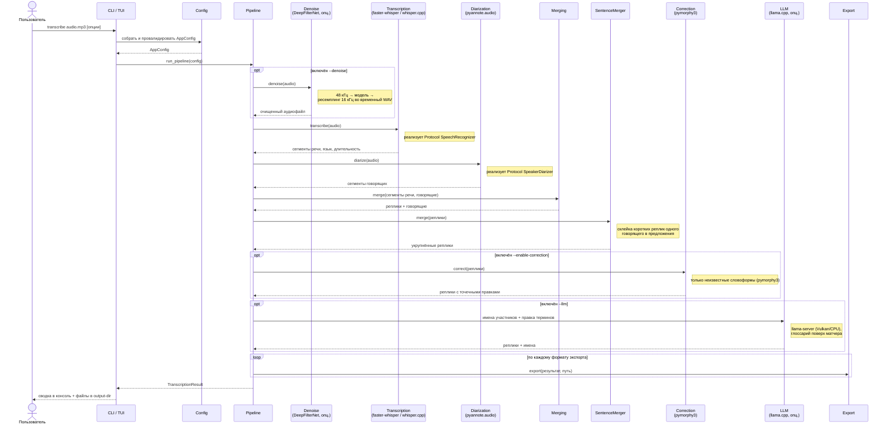

<div align="center">

# 🎙️ PyAudioTranscriptor

**Локальная утилита на Python для транскрибации аудиозаписей с разделением говорящих**

[](https://www.python.org/)
[](https://docs.astral.sh/uv/)
[](https://github.com/SYSTRAN/faster-whisper)
[-000000)](https://github.com/ggml-org/whisper.cpp)
[](https://github.com/pyannote/pyannote-audio)
[-555555)](https://github.com/ggml-org/llama.cpp)
[](https://textual.textualize.io/)
[](#)
[](#выбор-устройства-cpugpu)

</div>

Инструмент для подготовки стенограмм переговоров, интервью и судебных
материалов: распознаёт речь, определяет, кто из собеседников что говорит,
склеивает реплики в предложения, а затем может уточнить имена участников и
терминологию локальной LLM — и экспортирует стенограмму в удобном формате с
явной разметкой говорящих.

Работать можно двумя способами: из командной строки (CLI) и через
интерактивный полноэкранный интерфейс (TUI) в стиле htop.

Вся обработка выполняется полностью локально, без обращения к облачным API —
аудио и текст никогда не покидают ваш компьютер.

## Содержание

- [Возможности](#возможности)
- [Требования](#требования)
- [Установка](#установка)
- [Быстрый запуск (run.sh / config.env)](#быстрый-запуск-без-ручной-установки-и-параметров-в-командной-строке)
- [Интерактивный интерфейс (TUI)](#интерактивный-интерфейс-tui)
- [Использование (вручную, через uv)](#использование-вручную-через-uv)
  - [Основные параметры команды `transcribe`](#основные-параметры-команды-transcribe)
  - [Повышение точности распознавания](#повышение-точности-распознавания)
  - [Глоссарий терминов](#глоссарий-терминов)
  - [LLM-постобработка (имена и термины)](#llm-постобработка-имена-и-термины)
  - [Токен доступа для диаризации](#токен-доступа-для-диаризации)
  - [Выбор устройства (CPU/GPU)](#выбор-устройства-cpugpu)
  - [Логи](#логи)
- [Конфигурация `config.env`](#конфигурация-configenv)
- [Архитектура](#архитектура)
  - [Структура каталогов](#структура-каталогов)
  - [Назначение компонентов](#назначение-компонентов)
- [Тестирование](#тестирование)
  - [Интеграционные тесты](#интеграционные-тесты)
  - [Линтер и проверка типов](#линтер-и-проверка-типов)
- [Разработка](#разработка)

## Возможности

- **Распознавание речи** полностью локально, на выбор:
  - [`faster-whisper`](https://github.com/SYSTRAN/faster-whisper) — CUDA/CPU
    через PyTorch (по умолчанию);
  - [`whisper.cpp`](https://github.com/ggml-org/whisper.cpp) — GPU через
    **Vulkan**, поэтому работает и на AMD-картах **без ROCm**.
- **Определение говорящих** (диаризация) через
  [pyannote.audio](https://github.com/pyannote/pyannote-audio); можно
  использовать локальную копию модели и работать полностью офлайн.
- **Интерактивный TUI** на [Textual](https://textual.textualize.io/):
  выбор файлов, очередь на несколько записей, живой прогресс по этапам.
- **LLM-постобработка** локальной моделью через
  [llama.cpp](https://github.com/ggml-org/llama.cpp) (Vulkan):
  правка терминов по глоссарию (и экспериментальное, по умолчанию выключенное
  определение имён участников); при нехватке видеопамяти клиент сам деградирует
  до CPU.
- **Шумоподавление (денойз)** перед распознаванием и диаризацией на
  [DeepFilterNet](https://github.com/Rikorose/DeepFilterNet) — включено по
  умолчанию; если движок не установлен, этап мягко пропускается.
- **Глоссарий терминов**: несколько файлов сразу, явные пары
  «как слышит ASR = канон», односложные и фразовые термины, а также
  авто-сбор предложений о новых терминах.
- **Склейка реплик в предложения**: подряд идущие короткие сегменты одного
  говорящего объединяются, чтобы текст читался как связная речь.
- **Экспорт** стенограммы в TXT, DOCX, JSON и SRT с разметкой говорящих.
- Возможность задать **пользовательские имена говорящих** вместо
  `SPEAKER_00`, `SPEAKER_01`, ...
- **Автоисправление опечаток** ASR по морфологическому словарю
  (`--enable-correction`, по умолчанию выключено).
- **CLI на [Typer](https://typer.tiangolo.com/)** и полноценный TUI.

## Требования

- Python **3.14+**.
- [uv](https://docs.astral.sh/uv/) для управления зависимостями и окружением.
- **Оборудование (гибридная схема, выбрать одно):**
  - **NVIDIA + CUDA** — быстрый инференс через `faster-whisper`/PyTorch
    (на Windows/Linux CUDA-сборка `torch` ставится автоматически, см.
    [«Выбор устройства»](#выбор-устройства-cpugpu));
  - **AMD (или любой GPU) без ROCm** — `whisper.cpp` + `llama.cpp` через
    **Vulkan**; сборки `torch` при этом не нужны (подойдёт CPU-сборка);
  - **CPU** — как запасной вариант в любом случае (медленнее).
- **Локальные модели** (скачиваются один раз, дальше всё офлайн):
  - диаризация — модель pyannote;
  - распознавание для `whisper.cpp` — ggml-модель (`whisper-models/`);
  - LLM — GGUF-модель (`llama-models/`).
- **Шумоподавление (опционально)** — пакет
  [DeepFilterNet](https://github.com/Rikorose/DeepFilterNet); собирается из
  исходников (нужен Rust), см. раздел
  [«Шумоподавление (денойз)»](#шумоподавление-денойз). Без него конвейер
  работает как раньше.
- Аккаунт на [huggingface.co](https://huggingface.co) и токен доступа **нужны
  только** для первой загрузки модели диаризации. Если указана локальная
  копия модели (`PYANNOTE_LOCAL_MODEL`), токен и сеть не требуются — см.
  [«Токен доступа для диаризации»](#токен-доступа-для-диаризации).


## Установка

```bash
git clone <url-репозитория>
cd PyAudioTranscriptor
uv sync
```

`uv sync` создаст виртуальное окружение `.venv`, установит зависимости из
`pyproject.toml`/`uv.lock`, саму утилиту в редактируемом режиме и
dev-инструменты (`pytest`, `ruff`, `mypy`).

На Windows/Linux в зависимости уже включена CUDA-сборка PyTorch (см. раздел
[«Выбор устройства (CPU/GPU)»](#выбор-устройства-cpugpu)), поэтому `uv sync`
скачивает несколько гигабайт (в основном сам `torch` с бинарниками CUDA) —
это нормально и происходит один раз. Если CUDA не нужна (например, при работе
через Vulkan на AMD), достаточно CPU-сборки `torch`; запуск тогда идёт
напрямую через `.venv/bin/audio-transcriber` — так делает `run.sh`.

### Бинарники и модели для GPU-Vulkan

`faster-whisper` работает через PyTorch, а `whisper.cpp` и `llama.cpp` — это
отдельные нативные сборки. Для гибридной схемы (AMD/любой GPU через Vulkan)
рядом с проектом удобно держать:

```
whisper-native/   # whisper-cli + разделяемые библиотеки (.so) whisper.cpp
llama-native/     # llama-server + библиотеки llama.cpp (libggml-vulkan.so, ...)
whisper-models/   # ggml-модели для whisper.cpp (напр. ggml-large-v3-turbo.bin)
llama-models/     # GGUF-модели для LLM (напр. Qwen2.5-7B-Instruct Q4_K_M)
```

Важно: в сборках llama.cpp нового поколения бэкенды (`.so`) грузятся
динамически и ищутся **рядом с бинарником**, поэтому бинарник и библиотеки
должны лежать в одном каталоге. Пути к бинарникам, каталогам с библиотеками и
моделям задаются в `config.env` (`WHISPER_CPP_*`, `LLM_*`).

## Быстрый запуск (без ручной установки и параметров в командной строке)

В репозитории есть готовые скрипты-обёртки: `run.sh` (Linux/macOS) и
`run.ps1` / `run.bat` (Windows) — они не требуют команд `uv` и параметров в
командной строке. Скрипты сами устанавливают `uv`, если его нет, и запускают
транскрибацию с параметрами, которые вы один раз укажете в файле
`config.env`.

**Настройка (один раз):**

1. Скопируйте `config.example.env` в `config.env`.
2. Откройте `config.env` и укажите токен Hugging Face (см. раздел
   [«Токен доступа для диаризации»](#токен-доступа-для-диаризации)) либо путь
   к локальной модели (`PYANNOTE_LOCAL_MODEL`), а также модель, язык,
   бэкенд распознавания, пути к бинарникам/моделям Vulkan и параметры LLM.

**Запуск:**

- Linux/macOS:
  ```bash
  ./run.sh path/to/call.mp3
  ```
- Windows (PowerShell):
  ```powershell
  .\run.ps1 path\to\call.mp3
  ```
- Windows (без терминала): перетащите аудиофайл мышью на `run.bat`.

`run.sh` читает `config.env` и сам пробрасывает нужные параметры в CLI:
`ASR_BACKEND`, `WHISPER_CPP_MODEL/BINARY/LIB_PATH`, `LLM_*` (модель, бинарник,
контекст, CPU/GPU, извлечение имён, предложения терминов) и `GLOSSARY_PATH`.

Если позже понадобится изменить модель, язык, формат экспорта или другие
параметры — не нужно ничего вспоминать, просто откройте `config.env` и
поменяйте нужное значение. Полный список переменных — в разделе
[«Конфигурация `config.env`»](#конфигурация-configenv).

## Интерактивный интерфейс (TUI)

Вместо командной строки можно открыть полноэкранный интерфейс (htop-стиль):
выбрать файлы в дереве, поставить несколько записей в очередь и следить за
живым прогрессом по этапам прямо во время обработки.

- Linux/macOS: ярлык-скрипт `launch-tui.sh` (можно запускать двойным щелчком).
- Либо вручную:

  ```bash
  uv run audio-transcriber tui
  # или: .venv/bin/audio-transcriber tui
  ```

Настройки TUI берёт из того же `config.env`; LLM-клиент создаётся один раз на
всю очередь и гарантированно закрывается после её обработки. Шумоподавление
включается/выключается переключателем **«Шумоподавление (денойз)»** в простом
режиме настроек.

## Использование (вручную, через uv)

Запуск через `uv run`:

```bash
uv run audio-transcriber transcribe path/to/call.mp3
```

Также доступен запуск как модуль Python:

```bash
uv run python -m audio_transcriber transcribe path/to/call.mp3
```

Полная справка по параметрам:

```bash
uv run audio-transcriber transcribe --help
```

### Основные параметры команды `transcribe`

| Параметр | Короткая форма | Назначение | По умолчанию |
|---|---|---|---|
| `INPUT_FILE` (позиционный) | — | Путь к аудиофайлу (например, `.mp3`) | обязателен |
| `--output-dir` | `-o` | Директория для сохранения результатов (создаётся автоматически) | `output` |
| `--model` | `-m` | Модель faster-whisper (`tiny`, `base`, `small`, `medium`, `large-v3-turbo`, `large-v3`, ...) | `large-v3-turbo` |
| `--language` | `-l` | Код языка речи (`ru`, `en`, ...) | автоопределение |
| `--device` | `-d` | Устройство вычислений: `cuda` / `cpu` / `auto` | `auto` |
| `--format` | `-f` | Формат(ы) экспорта: `txt` / `docx` / `json` / `srt`. Можно указать несколько раз | `txt` |
| `--num-speakers` | `-n` | Точное количество говорящих, если оно известно заранее | автоопределение |
| `--speaker-name` | — | Имя говорящего в формате `ИНДЕКС=Имя`, напр. `0=Иван`. Можно указать несколько раз | `SPEAKER_00`, `SPEAKER_01`, ... |
| `--hf-token` | — | Токен доступа Hugging Face для модели диаризации (см. ниже) | из `HF_TOKEN` |
| `--initial-prompt` | — | Короткая подсказка стиля/контекста для самого начала записи | не задана |
| `--hotwords` | — | Короткий список слов-подсказок для ASR (лимит ~100 токенов) | не заданы |
| `--denoise` / `--no-denoise` | — | Шумоподавление (DeepFilterNet) перед распознаванием и диаризацией | включено |
| `--asr-backend` | — | Движок распознавания: `faster-whisper` или `whisper-cpp` | `faster-whisper` |
| `--whisper-cpp-model` | — | Путь к ggml-модели (обязателен при `--asr-backend whisper-cpp`) | — |
| `--whisper-cpp-binary` | — | Путь/имя бинарника `whisper-cli` | `whisper-cli` |
| `--whisper-cpp-lib-path` | — | Каталог с библиотеками whisper.cpp (`LD_LIBRARY_PATH`) | — |
| `--whisper-cpp-threads` | — | Число потоков whisper.cpp | значение бинарника |
| `--enable-correction` | — | Автоисправление опечаток ASR; только неизвестные словоформы | выключено |
| `--llm` | — | Включить LLM-постобработку (имена + термины) | выключено |
| `--llm-model` | — | Путь к GGUF-модели LLM | — |
| `--llm-binary` | — | Путь/имя бинарника `llama-server` | `llama-server` |
| `--llm-lib-path` | — | Каталог с библиотеками llama.cpp (`LD_LIBRARY_PATH`) | — |
| `--llm-gpu` / `--llm-cpu` | — | Инференс LLM на GPU (Vulkan) или CPU | GPU |
| `--llm-context` | — | Размер контекста LLM в токенах | `4096` |
| `--llm-names` / `--llm-no-names` | — | ЭКСПЕРИМЕНТАЛЬНО: определять имена участников через LLM | выключено |
| `--llm-suggest-terms` | — | Собрать термины-кандидаты в `<глоссарий>.suggested.txt` | выключено |
| `--glossary` | — | Путь(и) к файлам глоссария; можно несколько раз или через запятую | — |
| `--verbose` | `-v` | Подробный режим логирования (уровень DEBUG) | выключен |
| `--version` | — | Показать версию и выйти | — |

### Повышение точности распознавания

`faster-whisper` иногда заменяет редкие слова на похожие по звучанию —
например, вместо «взаимопонимания» может получиться «взаимоприимания».

1. **`--enable-correction`** — автоисправление опечаток ASR. Для неизвестных
   словоформ подбирается ближайшая известная форма русского языка
   (морфологический словарь OpenCorpora через `pymorphy3`). Пользовательский
   словарь терминов не нужен. По умолчанию выключено.

   Важно: исправляются **только** слова, которые морфологический анализатор
   не считает известными формами. Обычные слова и склонения («есть»,
   «представителем», «гражданского») не трогаются. Каждая замена пишется в лог:
   `Автоисправление: «Взаимоприимания» → «Взаимопонимания»`.

   ```bash
   uv run audio-transcriber transcribe recording.mp3 --enable-correction
   ```

   В `config.env`:

   ```
   ENABLE_CORRECTION=true
   CORRECTION_MIN_WORD_LENGTH=6
   CORRECTION_MIN_SIMILARITY=0.85
   CORRECTION_MAX_CANDIDATES=8000
   ```

2. **`--hotwords`** / **`--initial-prompt`** — короткие подсказки ASR во время
   распознавания (имена и 5–15 критичных терминов). Ограничены ~100 токенами
   Whisper; для больших списков не подходят.

Также по умолчанию включены отсечение тишины/не-речи (VAD) и уточнение границ
сегментов по словам.

#### Выбор модели: `medium` / `large-v3-turbo` / `large-v3`

По умолчанию используется `large-v3-turbo` — облегчённая версия `large-v3` от
OpenAI (меньше слоёв в декодере). На практике она распознаёт как минимум не
хуже `medium`, а часто точнее, и при этом работает быстрее — хороший вариант
по умолчанию для большинства видеокарт.

Полноразмерная `large-v3` точнее всего, но требует заметно больше видеопамяти
и работает медленнее — на слабых/старых GPU ей может не хватить видеопамяти
(ошибка `CUDA failed with error out of memory`), тогда придётся использовать
`--device cpu`, что значительно медленнее. Если видеокарта современная и с
большим объёмом памяти, стоит попробовать `--model large-v3` для максимальной
точности.

Полностью исключить ошибки распознавания невозможно — при работе с
материалами, где точность критична (например, для суда), финальный текст
рекомендуется дополнительно проверять на слух.

### Глоссарий терминов

Глоссарий — простой текстовый файл: один термин или пара в строке, строки,
начинающиеся с `#`, и пустые строки игнорируются. Термин может быть как одним
словом (`ОИБ`, `транскрибер`), так и фразой (`информационная безопасность`).

- **Обычные термины** приводятся к канону детерминированным матчером: он
  учитывает регистр и склонения, точные слова не меняет, а короткие
  аббревиатуры правит только при единственном кандидате.
- **Явные пары** `АИБ = ОИБ` («как слышит ASR = канон») применяются всегда и
  приоритетнее нечёткого сопоставления — надёжный способ гарантировать замену.
- **Несколько файлов** объединяются: `--glossary a.txt --glossary b.txt` или
  `GLOSSARY_PATH=a.txt,b.txt` (разделитель — запятая или `os.pathsep`).

Пример запуска:

```bash
uv run audio-transcriber transcribe call.mp3 --glossary glossary.txt
```

Шаблон формата — `glossary.example.txt`. Если включён `--llm-suggest-terms`
(или `LLM_SUGGEST_TERMS=true`), рядом с первым глоссарием появится файл
`<имя>.suggested.txt` с терминами-кандидатами (частота и источник) — их можно
вручную перенести в глоссарий.

### LLM-постобработка (имена и термины)

Локальная LLM через `llama.cpp` (`llama-server`, GPU через Vulkan или CPU)
решает две задачи:

1. **Имена участников (ЭКСПЕРИМЕНТАЛЬНО, по умолчанию выключено).**
   Модель читает стенограмму с метками «Спикер N» и возвращает имя только при
   явном основании в тексте; имя, которого нет в стенограмме, не применяется
   (защита от галлюцинаций). Функция пока нестабильна — включайте осознанно
   (`--llm-names` или `LLM_EXTRACT_NAMES=true`).
2. **Правка терминов.** Поверх детерминированного матчера LLM дополнительно
   находит спорные ASR-опечатки терминов, но применить разрешено только замену
   на канонический термин из глоссария.

Включается флагом `--llm` и указанием модели:

```bash
uv run audio-transcriber transcribe call.mp3 \
  --asr-backend whisper-cpp \
  --whisper-cpp-model whisper-models/ggml-large-v3-turbo.bin \
  --llm --llm-model llama-models/qwen2.5-7b-instruct-q4_k_m.gguf \
  --glossary glossary.txt
```

В `config.env` используются `LLM_ENABLED`, `LLM_MODEL`, `LLM_BINARY`,
`LLM_LIB_PATH`, `LLM_GPU`, `LLM_CONTEXT`, `LLM_EXTRACT_NAMES`,
`LLM_SUGGEST_TERMS` и `GLOSSARY_PATH`. При нехватке видеопамяти клиент
деградирует сам: частичная выгрузка слоёв на GPU, затем чистый CPU.

### Шумоподавление (денойз)

Перед распознаванием и диаризацией запись можно очистить от фонового шума
нейросетевой моделью [DeepFilterNet](https://github.com/Rikorose/DeepFilterNet)
(DeepFilterNet3). Этап включён по умолчанию и стоит первым в конвейере:
**один и тот же очищенный файл** получают и ASR, и диаризация, поэтому их
временные метки согласованы, а объединение (`merge`) остаётся корректным.

Как выключить:

- CLI: `--no-denoise`;
- `config.env`: `DENOISE=false` (тогда `run.sh` передаст `--no-denoise`);
- TUI: переключатель **«Шумоподавление (денойз)»**.

#### Установка

DeepFilterNet объявляет зависимость `numpy<2`, а проект использует `numpy 2.x`
(для Python 3.14 колёс под `numpy 1.26` нет). Поэтому пакет ставится **вручную
без зависимостей** — так основной `numpy`/`torch` не откатываются. Сборка
`libDF` идёт на Rust, нужен установленный `cargo`/`rustc`:

```bash
# установить Rust, если его нет: https://rustup.rs
uv pip install --python .venv/bin/python --no-deps \
    deepfilternet deepfilterlib appdirs loguru
```

Проверка:

```bash
.venv/bin/python -c "from df import enhance, init_df; print('DeepFilterNet OK')"
```

При первом запуске модель (~9 МБ) скачивается в кэш
`~/.cache/DeepFilterNet/DeepFilterNet3`; дальше инференс полностью локальный и
офлайн. Если пакет не установлен или модель недоступна, этап **мягко
пропускается** с предупреждением в лог — конвейер продолжает работать на
исходном аудио (то же и при сбое декодирования файла).

> В `pyproject.toml` DeepFilterNet объявлен как необязательный extras
> `denoise` (с маркером `python_version < '3.14'`), чтобы он не ломал общий
> резолв зависимостей. На Python 3.14 используйте команду выше. Учтите, что
> `uv sync` синхронизирует окружение строго по `uv.lock` и может удалить
> вручную поставленные пакеты — при необходимости просто повторите установку.

#### Производительность

DeepFilterNet работает на 48 кГц моно; конвейер — на 16 кГц. Полный цикл:
декодирование (PyAV) → 48 кГц → модель → ресемплинг в 16 кГц → временный WAV.
Замер на CPU (без GPU), 90-секундный фрагмент телефонного разговора:
чистый инференс **≈ 3.2 с** (RTF ≈ `0.035`, то есть ~28× быстрее реального
времени); с учётом декодирования/ресемплинга/записи и однократной загрузки
модели — **≈ 4.3 с** (RTF ≈ `0.048`).

Технические детали: аудио читается через PyAV (а не `torchaudio.load`,
который зависит от `torchcodec`), а совместимость `df.io` с torchaudio ≥ 2.9
(удалённый `torchaudio.backend.common`) обеспечивается небольшой заглушкой в
`denoising/deepfilter.py` — `site-packages` не изменяется.

### Токен доступа для диаризации

Модель диаризации распространяется через Hugging Face и требует один раз
зарегистрироваться, принять условия использования и получить токен доступа.
Никакой оплаты это не требует — аккаунт и токен полностью бесплатны:

1. Зарегистрируйтесь на [huggingface.co](https://huggingface.co/join) (если
   аккаунта ещё нет).
2. Примите условия [`pyannote/speaker-diarization-community-1`](https://hf.co/pyannote/speaker-diarization-community-1)
   — откройте страницу модели и нажмите «Agree and access repository».
3. Создайте токен на [hf.co/settings/tokens](https://hf.co/settings/tokens)
   (достаточно прав `Read`).
4. Передайте токен утилите одним из способов:
   - через параметр `--hf-token <токен>`;
   - через переменную окружения `HF_TOKEN` (также поддерживается
     `HUGGING_FACE_HUB_TOKEN`). В PowerShell для текущей сессии:

     ```powershell
     $env:HF_TOKEN = "hf_xxx..."
     ```

Сама диаризация после загрузки модели выполняется полностью локально —
токен нужен только для первого скачивания весов модели, дальнейшие запуски
используют уже сохранённый локальный кэш Hugging Face.

Если сеть и токен нежелательны, укажите заранее скачанную локальную копию
модели (`--pyannote-local-model /путь/к/модели` или `PYANNOTE_LOCAL_MODEL` в
`config.env`) — тогда модель грузится с диска, а токен и интернет не нужны.

### Выбор устройства (CPU/GPU)

Утилита работает по гибридной схеме: распознавание — либо через
`faster-whisper`/PyTorch (CUDA/CPU), либо через `whisper.cpp`/Vulkan (для
AMD-карт без ROCm, а также любых GPU с драйвером Vulkan). Диаризация
выполняется на CPU или CUDA, LLM — на Vulkan/CPU через `llama.cpp`.

- **`--asr-backend faster-whisper`** (по умолчанию): PyTorch ускоряет
  вычисления через CUDA, при её отсутствии автоматически используется CPU.
  Устройство задаётся флагом `--device auto|cuda|cpu`.
- **`--asr-backend whisper-cpp`**: распознавание идёт в нативном `whisper-cli`
  через Vulkan, при этом `--device` управляет только диаризацией (в этой схеме
  pyannote всегда считается на CPU — у него нет Vulkan-бэкенда).

```bash
uv run audio-transcriber transcribe records/call.mp3 --device cuda
```

На macOS CUDA-сборок PyTorch не существует — там `uv sync` ставит обычный
CPU-индекс; нативные сборки `whisper.cpp`/`llama.cpp` при этом можно собрать
под Metal/Vulkan отдельно.

`pyproject.toml` уже настроен так, чтобы `uv sync` на Windows/Linux
устанавливал именно CUDA-сборку PyTorch (`[tool.uv.sources]` /
`[[tool.uv.index]]`), а не CPU-only пакет из обычного PyPI — иначе
`torch.cuda.is_available()` всегда возвращает `False`, даже если GPU и
драйверы в порядке. На macOS, где CUDA-сборок PyTorch не существует,
используется обычный CPU-индекс.

Версии `torch`/`torchaudio` закреплены (`torch<2.13`, `torchaudio<2.12`) на
последней сборке с CUDA 12.6 — это осознанное ограничение: начиная со
следующих версий PyTorch перестал выпускать сборки под CUDA 12.6, а именно
эта ветка CUDA — последняя, поддерживающая GPU архитектур Maxwell, Pascal и
Volta (например, GTX 900/1000-й серии). На более новых картах (RTX 20xx и
новее) можно ослабить это ограничение и использовать более новую CUDA-ветку
(`cu128`, `cu130` и т.д. — см. [актуальный список](https://download.pytorch.org/whl/)).

Проверить, что PyTorch действительно видит GPU, можно так:

```bash
uv run python -c "import torch; print(torch.__version__, torch.cuda.is_available(), torch.cuda.get_device_name(0))"
```

Если `--device cuda` всё равно завершается ошибкой «CUDA не найдена», хотя
видеокарта NVIDIA есть, проверьте:

- установлены ли актуальные драйверы NVIDIA (`nvidia-smi` должен показывать GPU);
- не установился ли CPU-only `torch` (команда выше должна вывести `True`,
  а версия должна содержать суффикс `+cuXXX`, например `2.12.1+cu126`, а не
  `+cpu`). Если суффикс `+cpu` — выполните `uv sync` заново после проверки
  секции `[tool.uv.sources]` в `pyproject.toml`;
- достаточно ли новая архитектура GPU для выбранной ветки CUDA (см. выше про
  Pascal/Maxwell/Volta и CUDA 12.6).

### Логи

Помимо вывода в консоль, каждый запуск `transcribe` сохраняет полный
DEBUG-лог в файл `<output-dir>/logs/audio-transcriber_ГГГГММДД_ЧЧММСС.log` —
независимо от того, указан ли `--verbose`. Это удобно для диагностики
ошибок (например, отсутствующего токена Hugging Face) постфактум, без
необходимости повторного запуска с `--verbose`.

Обработку можно в любой момент безопасно прервать нажатием `Ctrl+C` —
утилита корректно завершится с сообщением об остановке вместо traceback.

Пример с несколькими форматами экспорта и именами говорящих:

```bash
uv run audio-transcriber transcribe records/call.mp3 \
  --output-dir out/call \
  --model medium \
  --language ru \
  --device auto \
  --format txt --format docx \
  --num-speakers 2 \
  --speaker-name 0=Иван \
  --speaker-name 1=Мария \
  --verbose
```

## Конфигурация `config.env`

`run.sh` (и `run.ps1`/`run.bat`) читает файл `config.env` в корне проекта и
пробрасывает его значения в CLI. Шаблон со всеми комментариями —
`config.example.env`. Основные переменные:

| Переменная | Назначение |
|---|---|
| `HF_TOKEN` | Токен Hugging Face для первой загрузки модели диаризации |
| `PYANNOTE_LOCAL_MODEL` | Путь к локальной копии модели диаризации (офлайн, без токена) |
| `MODEL` | Модель faster-whisper (`large-v3-turbo`, `medium`, ...) |
| `ASR_BACKEND` | `faster-whisper` или `whisper-cpp` |
| `WHISPER_CPP_MODEL` | Путь к ggml-модели для whisper.cpp |
| `WHISPER_CPP_BINARY` | Путь/имя бинарника `whisper-cli` |
| `WHISPER_CPP_LIB_PATH` | Каталог с библиотеками whisper.cpp (`LD_LIBRARY_PATH`) |
| `LANGUAGE` | Код языка речи (`ru`, `en`, ...); пусто — автоопределение |
| `DEVICE` | `cuda`, `cpu` или `auto` (для faster-whisper и диаризации) |
| `FORMATS` | Форматы экспорта через запятую: `txt,docx,json,srt` |
| `NUM_SPEAKERS`, `SPEAKER_NAMES` | Число говорящих и имена `ИНДЕКС=Имя` |
| `HOTWORDS` | Короткие подсказки ASR через запятую |
| `DENOISE` | Шумоподавление DeepFilterNet перед ASR/диаризацией (`true`/`false`) |
| `ENABLE_CORRECTION`, `CORRECTION_*` | Автоисправление опечаток и его параметры |
| `LLM_ENABLED` | Включить LLM-постобработку (`true`/`false`) |
| `LLM_MODEL` | Путь к GGUF-модели LLM |
| `LLM_BINARY`, `LLM_LIB_PATH` | Бинарник `llama-server` и каталог его библиотек |
| `LLM_GPU` | Инференс LLM на GPU (Vulkan) или CPU |
| `LLM_CONTEXT` | Размер контекста LLM в токенах (по умолчанию `4096`) |
| `LLM_EXTRACT_NAMES` | Определять имена участников через LLM |
| `LLM_SUGGEST_TERMS` | Собирать кандидатов в термины в `<глоссарий>.suggested.txt` |
| `GLOSSARY_PATH` | Путь(и) к глоссариям: список через запятую или `os.pathsep` |
| `OUTPUT_DIR` | Директория результатов (`output` по умолчанию) |
| `VERBOSE` | Подробное логирование (`true`/`false`) |

`config.env` содержит токен и личные настройки, поэтому он не попадает в git
(см. `.gitignore`).

## Архитектура

Проект разбит на независимые компоненты, взаимодействующие через чёткие
интерфейсы (`typing.Protocol`). Это позволяет заменить движок распознавания,
диаризации, коррекции или LLM без изменения остального кода — достаточно
реализовать соответствующий протокол.

Схема отражает фактический порядок вызовов в `pipeline.py`: конвейер строго
последовательный (диаризация начинается только после завершения
распознавания), а не параллельный.



- **CLI / TUI / Config** — принимают команду или данные формы, валидируют
  параметры запуска (`AppConfig`).
- **Denoise (опционально)** — подавляет фоновый шум (DeepFilterNet) и отдаёт
  один очищенный аудиофайл и распознаванию, и диаризации, чтобы их временные
  метки совпадали. Если движок недоступен — этап пропускается.
- **Transcription / Diarization** — вызываются последовательно, каждый за
  интерфейсом `typing.Protocol`: движок можно заменить (faster-whisper ⇄
  whisper.cpp, другая диаризация) без изменения остального кода. Merging
  сопоставляет их результаты по времени.
- **SentenceMerger** — склеивает подряд идущие короткие сегменты одного
  говорящего в реплики-предложения, чтобы корректор и LLM видели цельный текст.
- **Correction** — опциональное автоисправление опечаток; меняет только слова,
  неизвестные морфологическому анализатору русского языка.
- **LLM** — опциональная постобработка локальным `llama.cpp`: имена участников
  и правка терминов по глоссарию.
- **Export** — сохраняет результат в каждый из запрошенных форматов.

`domain` (модели данных), `progress` (события прогресса для TUI) и `utils`
(логирование, работа с устройством CPU/CUDA, исключения) используются всеми
участниками насквозь и не показаны на схеме отдельно.


### Структура каталогов

<details>
<summary>📂 Показать дерево каталогов</summary>

```
PyAudioTranscriptor/
├── pyproject.toml          # зависимости, точка входа CLI, конфигурация pytest/ruff/mypy
├── uv.lock                 # зафиксированные версии зависимостей
├── run.sh                  # запуск для Linux/macOS: пробрасывает config.env в CLI
├── run.ps1 / run.bat       # запуск для Windows (PowerShell / перетаскиванием файла)
├── launch-tui.sh           # ярлык запуска интерактивного интерфейса (TUI)
├── config.example.env      # шаблон параметров (скопировать в config.env)
├── glossary.example.txt    # шаблон формата глоссария терминов
├── src/audio_transcriber/  # исходный код пакета (см. ниже)
└── tests/                  # тесты pytest (см. ниже)
```

<details>
<summary>📦 <code>src/audio_transcriber/</code> — исходный код пакета</summary>

```
src/audio_transcriber/
├── __init__.py     # версия пакета (__version__)
├── __main__.py     # запуск через `python -m audio_transcriber`
├── progress.py     # ProgressEvent/ProgressCallback — события прогресса для TUI
│
├── cli/            # Слой CLI (Typer)
│   └── app.py      #   команды `transcribe` и `tui`
│
├── tui/            # Интерактивный интерфейс (Textual)
│   └── app.py      #   очередь файлов, живой прогресс, настройки
│
├── config/         # Конфигурация запуска
│   └── settings.py #   AppConfig: сборка и валидация параметров
│
├── domain/         # Доменные модели — не зависят ни от одного движка
│   ├── enums.py    #   Device, AsrBackend, ExportFormat
│   └── models.py   #   TranscriptionSegment, SpeakerSegment,
│                   #   Speaker, TranscriptEntry, TranscriptionResult
│
├── transcription/  # Распознавание речи (ASR)
│   ├── base.py     #   протокол SpeechRecognizer
│   ├── whisper_engine.py     # faster-whisper (CUDA/CPU через PyTorch)
│   └── whisper_cpp_engine.py # whisper.cpp (GPU через Vulkan, AMD без ROCm)
│
├── diarization/    # Определение говорящих
│   ├── base.py     #   протокол SpeakerDiarizer
│   └── pyannote_engine.py # pyannote.audio (в т.ч. локальная модель офлайн)
│
├── denoising/      # Шумоподавление (денойз) перед ASR/диаризацией
│   ├── base.py     #   протокол DenoiserProtocol
│   └── deepfilter.py # DeepFilterNet: 48 кГц → 16 кГц, мягкая деградация
│
├── merging/        # Объединение сегментов ASR + диаризации
│   ├── base.py     #   протокол SegmentMerger
│   ├── aligner.py  #   сопоставление по максимальному перекрытию во времени
│   └── sentence_merger.py # склейка коротких реплик одного говорящего
│
├── correction/     # Автоисправление опечаток
│   ├── base.py     #   протокол TextCorrector
│   └── morph_corrector.py # OpenCorpora через pymorphy3
│
├── llm/            # Локальная LLM-постобработка (llama.cpp)
│   ├── base.py     #   протокол LlmClient
│   ├── client.py   #   клиент к llama-server (Vulkan/CPU, автоочистка процессов)
│   ├── glossary.py #   глоссарий: детерминированный матчер терминов
│   └── postprocess.py # извлечение имён и правка терминов
│
├── export/         # Экспорт результата
│   ├── base.py     #   протокол ResultExporter
│   ├── txt_exporter.py
│   ├── docx_exporter.py
│   ├── json_exporter.py
│   ├── srt_exporter.py
│   ├── timestamps.py #  форматирование временных меток
│   └── factory.py  #   выбор экспортёра по формату
│
├── utils/          # Сквозные утилиты
│   ├── exceptions.py #  иерархия исключений приложения
│   ├── logging.py    #  настройка логирования (rich)
│   ├── device.py     #  выбор CUDA/CPU, ленивый импорт torch
│   ├── audio.py      #  декодирование и ресемплинг аудио через PyAV
│   └── hotwords.py   #  ограничение длины --hotwords для ASR
│
└── pipeline.py     # сборка конвейера, используется CLI и TUI
```

</details>

<details>
<summary>🧪 <code>tests/</code> — тесты pytest, зеркалируют структуру <code>src/</code></summary>

```
tests/
├── conftest.py
├── test_config_settings.py
├── test_device.py
├── test_audio.py
├── test_denoising.py
├── test_cli.py
├── test_tui.py
├── test_hotwords.py
├── test_correction.py
├── test_glossary.py
├── test_llm_client.py
├── test_llm_postprocess.py
├── test_merging.py
├── test_sentence_merger.py
├── test_export.py
├── test_logging.py
├── test_pipeline.py
├── test_integration.py  # реальный конвейер на tests_jfk.flac (маркер integration)
└── tests_jfk.flac        # тестовая аудиозапись для интеграционного теста
```

</details>

</details>

### Назначение компонентов

- **`cli`** — точка входа для пользователя. Парсит аргументы командной строки
  через Typer, передаёт их в `config`, обрабатывает ошибки домена
  (`AudioTranscriberError`) и печатает понятные сообщения с корректными кодами
  выхода. Команды: `transcribe` и `tui`.
- **`tui`** — интерактивный интерфейс на Textual: выбор файлов, очередь,
  живой прогресс по событиям `progress`. Работает поверх того же `run_pipeline`.
- **`config`** — превращает «сырые» аргументы CLI в валидированный `AppConfig`
  (dataclass): проверяет существование входного файла, создаёт выходную
  директорию, разбирает пользовательские имена говорящих и пути глоссариев.
- **`domain`** — модели данных (`dataclass`), которыми обмениваются все
  остальные слои: сегменты речи, сегменты говорящих, финальные реплики
  стенограммы. Не содержит логики и не зависит ни от одной из библиотек
  распознавания/диаризации/экспорта.
- **`transcription`** — распознаёт речь через `WhisperSpeechRecognizer`
  (faster-whisper) или `WhisperCppRecognizer` (whisper.cpp/Vulkan); оба
  реализуют протокол `SpeechRecognizer`.
- **`diarization`** — определяет говорящих через `PyannoteSpeakerDiarizer`
  (pyannote.audio, в т.ч. локальная модель), реализующий протокол
  `SpeakerDiarizer`.
- **`denoising`** — шумоподавление через `DeepFilterDenoiser` (DeepFilterNet),
  реализующий протокол `DenoiserProtocol`. Работает на 48 кГц, отдаёт готовый
  WAV 16 кГц моно (декодирование/ресемплинг — через `utils.audio`). Мягко
  деградирует: при отсутствии движка или сбое возвращает исходный путь.
- **`merging`** — сопоставляет по времени сегменты речи (`transcription`) и
  сегменты говорящих (`diarization`), формируя реплики `TranscriptEntry`; затем
  `SentenceMerger` склеивает подряд идущие короткие реплики одного говорящего.
- **`correction`** — автоисправление опечаток через `MorphTextCorrector`.
  Для неизвестных словоформ подбирается ближайшая известная форма русского
  языка (`pymorphy3` / OpenCorpora); известные слова и склонения не изменяются.
- **`llm`** — локальная LLM-постобработка: клиент к `llama-server`
  (`client.py`, Vulkan/CPU, гарантированная очистка процессов), глоссарий с
  детерминированным матчером (`glossary.py`) и связка обоих в извлечение имён
  и правку терминов (`postprocess.py`).
- **`progress`** — `ProgressEvent`/`ProgressCallback`: единый канал событий о
  ходе обработки, который используют CLI, TUI и компоненты конвейера.
- **`export`** — сохраняет готовый `TranscriptionResult` в выбранные форматы.
  Контракт `ResultExporter` позволяет добавлять новые форматы без изменения
  остального кода.
- **`utils`** — общие для всех слоёв утилиты: иерархия исключений
  (`exceptions.py`), настройка логирования через `rich` (`logging.py`),
  определение/резолвинг вычислительного устройства CPU/CUDA (`device.py`),
  декодирование аудио через PyAV (`audio.py`) и ограничение длины `--hotwords`
  (`hotwords.py`).
- **`pipeline.py`** — точка сборки конвейера: (денойз) → распознавание →
  диаризация → объединение → склейка реплик → (коррекция) → (LLM) → экспорт.
  Используется CLI и TUI.

## Тестирование

Тесты написаны на `pytest` и лежат в `tests/`, зеркалируя структуру `src/`.

Запуск всех быстрых тестов (без интеграционных):

```bash
uv run pytest
```

Подробный вывод по каждому тесту:

```bash
uv run pytest -v
```

Запуск тестов только для конкретного модуля, например конфигурации:

```bash
uv run pytest tests/test_config_settings.py
```

С отчётом о покрытии кода (требует `pytest-cov`, при необходимости
установите через `uv add --dev pytest-cov`):

```bash
uv run pytest --cov=audio_transcriber
```

`pytest` уже настроен в `pyproject.toml` (`[tool.pytest.ini_options]`), так
что дополнительная конфигурация не требуется — команда `uv run pytest`
работает сразу после `uv sync`.

### Интеграционные тесты

`tests/test_integration.py` прогоняет полный конвейер (распознавание →
объединение → склейка реплик → экспорт во все форматы) на реальной короткой
записи `tests/tests_jfk.flac`. Такие тесты помечены маркером `integration` и
**не** запускаются по умолчанию (см. `addopts` в `pyproject.toml`), так как при
первом запуске скачивают модель распознавания:

```bash
uv run pytest -m integration
```

Диаризация в этом тесте подменена заглушкой с одним говорящим — готовые модели
pyannote.audio требуют отдельного токена доступа Hugging Face (см. раздел
[«Токен доступа для диаризации»](#токен-доступа-для-диаризации)), что не нужно
для проверки связки распознавание → объединение → склейка → экспорт.

### Линтер и проверка типов

В проекте настроены [Ruff](https://docs.astral.sh/ruff/) (линт + сортировка
импортов) и [mypy](https://mypy-lang.org/) — конфигурация в `pyproject.toml`
(`[tool.ruff]`, `[tool.mypy]`). Оба инструмента входят в dev-группу и
устанавливаются через `uv sync`.

```bash
uv run ruff check src tests        # линт
uv run ruff format --check src     # проверка форматирования
uv run mypy                        # проверка типов (src/)
```

## Разработка

Зависимости для разработки (`pytest`, `ruff`, `mypy`) объявлены в отдельной
dev-группе `pyproject.toml` и устанавливаются автоматически при `uv sync`.

Добавить новую зависимость:

```bash
uv add <package>          # обычная зависимость
uv add --dev <package>    # зависимость для разработки/тестов
```
